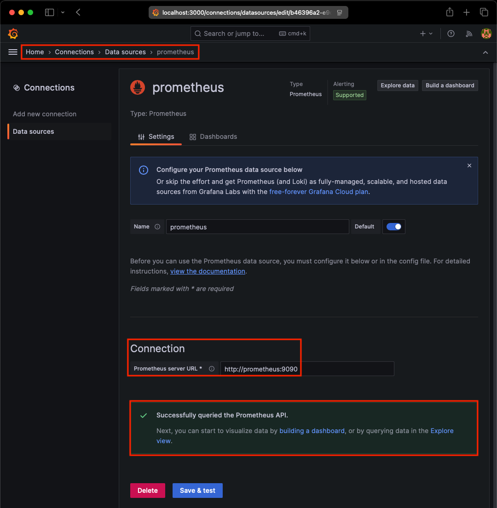
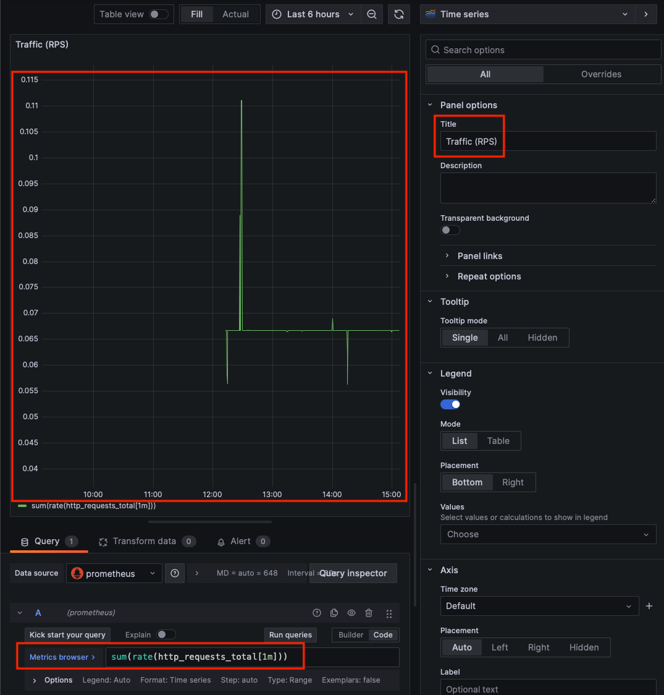
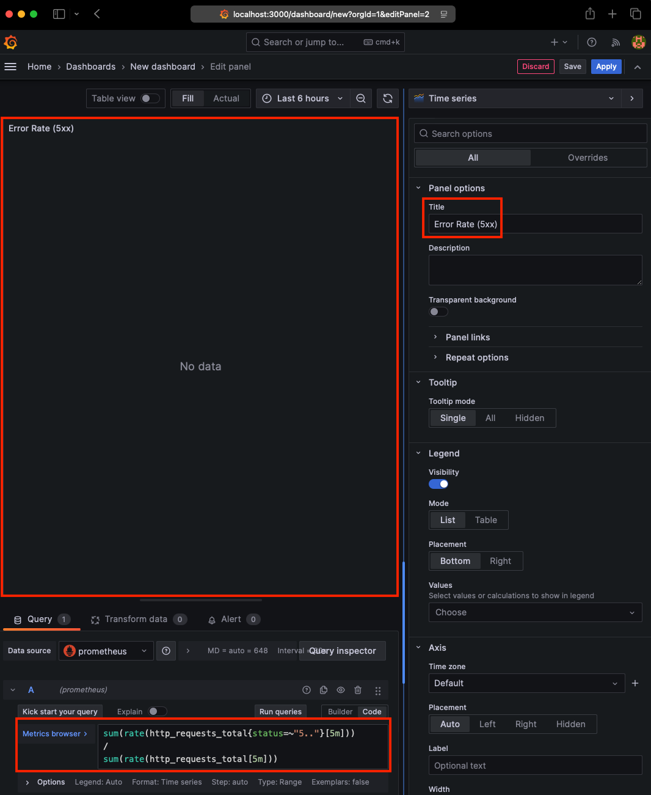
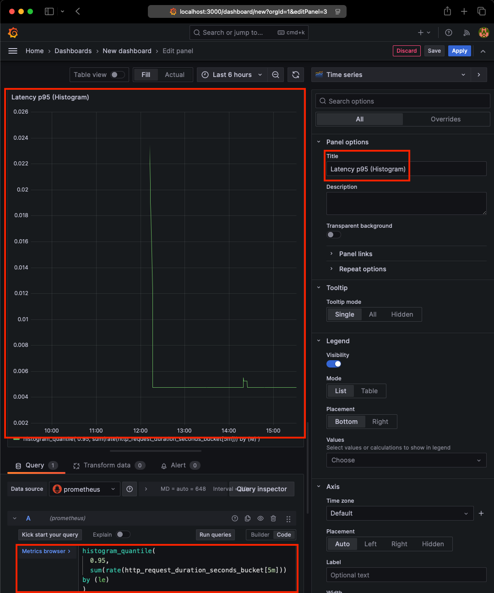

# SRE mini Project

본 프로젝트는 SRE 관점에서

- 서비스 신뢰성 측정
- 관측 가능성(Observability) 구축
- 장애 유도 및 대응
- RCA 문서화

를 목표로 하는 미니프로젝트 입니다.

## 구조


## 2.요구사항

### 2.1. 서비스(API) - Verification

본 API는 신뢰성 테스트 목적의 서비스로, 정상 응답/ 의도적 지연/ 의도적 5xx 오류를 재현할 수 있다.

#### 2.1.1 정상 응답

- Endpoint: `/health`
- Expected: HTTP 200 + JSON body

```bash
curl -i http://localhost:8080/health
```


#### 2.1.2 의도적인 응답 지연

- Endpoint: /slow?ms=1000
- Expected: HTTP 200, total time ≈ 1s 이상

```bash
curl -s -w '\nstatus=%{http_code} total=%{time_total}s\n' 'http://localhost:8080/slow?ms=1000' -o /dev/null
```


#### 2.1.3 의도적인 오류

- Endpoint: /error
- Expected: HTTP 500 (intentional)

```bash
curl -i http://localhost:8080/error
```


### 2.2. Obervability 스택

본 프로젝트는 Metrics 기반 관측 가능성(Observability)을 목표로 하며, 아래 구성으로 수집/시각화/알림을 구현합니다.

#### 2.2.1 Metrics: Prometheus

API는 /metrics에서 Prometheus 형식의 메트릭을 노출하며, Prometheus는 해당 엔드포인트를 scrape 하여 시계열 데이터로 저장한다.
본 프로젝트에서는 API의 요청 수/지연 시간/오류 응답 같은 신뢰성 지표(SLI 후보) 를 수집하기 위해 Prometheus를 사용합니다.

##### 2.2.1.1 API and prometheus metrics structure


Prometheus는 기본 scrape_interval(15s)에 따라 API의 /metrics 엔드포인트를 주기적으로 수집한다.
scrape_interval=15s는 데모 환경에서 메트릭 반응성을 확보하면서 과도한 scrape 부하를 피하기 위한 기본값으로 설정하였다.

##### 2.2.1.2 API 노출(expose)


사용자가 확인하는 URL은 http://localhost:8080/metrics 이며, Prometheus는 docker network 내부에서 http://api:8080/metrics 를 scrape 대상으로 사용한다.

##### 2.2.1.3 prometheus 수집(scrape)


사용자가 확인하는 URL은 http://localhost:9090/metrics 이며, Prometheus는 docker network 내부에서 http://prometheus:9090/metrics 를 scrape 하는 주체으로 사용한다.

##### 2.2.1.4 quary at prometheus graph


- http_requests_total: Counter (누적 요청 수)
- http_request_duration_seconds: Histogram (지연 시간 분포)

Counter는 누적 값으로 트래픽 추이를 확인하는 데 사용되며,Histogram은 p95/p99 지연 시간과 같은 SLO 계산의 기반이 된다.
해당 메트릭들은 이후 SLI/SLO 정의(가용성, 지연시간) 및 Alert Rule의 기반으로 사용된다.

#### 2.2.2 Visualization: Grafana


본 구조에서는 API가 /metrics 엔드포인트를 통해 메트릭을 노출하고, Prometheus가 이를 주기적으로 수집하여 TSDB에 저장한다. Grafana는 Prometheus의 Query API에 PromQL 요청을 전달하며, Prometheus는 내부 TSDB에서 시계열 데이터를 조회한 뒤 PromQL 연산을 수행하고, 계산된 결과를 Grafan에 반환한다.

##### 2.2.2.1 Data Source



Granafa에서 Prometheus를 Data Source로 등록하였다.
Docker Compose 환경에서 서비스 간 통신을 위해 Prometheus의 내부 주소(http://prometheus:9090)을 사용하였으며, Data Source 연결 테스트를 통해 정상적으로 메트릭을 조회할 수 있음을 확인하였다.

##### 2.2.2.2 Dashboard and Panel 구성

1. **Traffic (RPS)**

    

    Traffic 패널은 API에 유입되는 요청량을 초당 요청수(RPS)기준으로 시각화 한다.
    요청량의 변화는 서비스 부하 상태를 판단하는 기본 관측 지표로 활용한다.

1. **Error Rate (5xx)**

    Error Rate 패널은 전체 요청 대비 HTTP 5xx 응답 비율을 나타낸다.
    서버 오류는 사용자 경험에 직접적인 영향을 미치므로 핵심 관측 지표로 설정하였다.

    ```query
    sum(rate(http_requests_total{status=~"5.."}[5m]))
    /
    sum(rate(http_requests_total[5m]))
    ```

    현재 환경에서는 HTTP 5xx응답이 발생하지 않아 에러율은 0에 수렴하는 값을 보인다. 이는 서비스가 정상 상태임을 의미하며, 장애 발생시 해당 패널을 통해 즉각적인 이상탐지가 가능하다.

    

1. **Latency (p95)**

    평균 지연시간은 일부 느린 요청을 가릴 수 있으므로, 히스토그램 기반 p95 지연시간을 사용하여 상위 지연 요청을 기준으로 서비스 응답성을 관측하였다.

    ```query
    histogram_quantile(
    0.95,
    sum(rate(http_request_duration_seconds_bucket[5m])) by (le)
    )
    ```

    - API 요청 시 p95 지연시간이 시간 흐름에 따라 변화
    - Histogram 기반 metric이 정상적으로 집게됨을 확인

    

1. **결과 요약**

    

    위 구성을 통해 API서비스에 대한 트래픽, 오류, 지연시간을 Grafana 대시보드에서 통합적으로 관측할 수 있음을 확인하였다. 이는 Prometheus 기반 메트릭 수집과 Grafana 시각화가 정상적으로 연동되었음을 의미하며, 서비스 상태를 실시가으로 파악할 수 있는 기본적인 Observavility 환경을 구축하였다.

#### 2.2.3 Alerting: Prometheus Alert Rule 또는 Grafana Alert

본 프로젝트에서는 서비스 신뢰성 위반을 감지하기 위해 Prometheus Alert Rule을 사용한다. Alert는 SLI 후보지표(Availabitity, Error Rate, Latency)를 기반으로 정의되며, Grafana는 Alert 분석을 위한 시각화 도구로 활용된다.

주요 ALert는 다음과 같다:
    - API Down (Availability)
    - High Error Rate (5xx)
    - High Latency (p95)

Prometheus는 Alert Rule을 평가하여 Alert 이벤트를 생성하지만, 실제 알림 전송(Mail, Slack 등), 그룹핑, 중복제거는 ALertmanager가 담당한다.

##### 2.2.3.1 Alerting Architecture


본 프로젝트에서는 서비스 신뢰서 위반을 감지하기 우해 Prometheus Alert Rule을 사용한다.
Alert는 SLI후보 지표인 Availavbility, Error Rate, Latency를 기반으로 정의된다.

##### 2.2.3.2 Alert Validation Summary

- Prometheus가 alert-rules.yml에 정의된 규칙을 정상적으로 평가함을 확인하였다.
- Alert는 Inactive -> Firing -> Resolved 상태 전이를 의도한 대로 수행하였다.
- Alertmanager는 수신된 Alert를 설정된 기준에 따라 정상적으로 라우팅 및 그룹핑하였다.
- Alert 전달은 로컬 webhook receiver를 통해 검증되었으며, HTTP 200을 통해 실제 전송이 이루어졌음을 확인하였다.
- 외부 서비스 (Slack,Email 등)에 의존하지 않고도 Alert 평가 및 전달 과정을 완전 재현 가능하게 구성하였다.

1. **Validation Scpoe**

    - Rule evaluation
        
        
        Prometheus가 alert-rules.yml에 정의된 규칙을 정상적으로 평가함을 확인하였다.

        TestAlwaysFiring Alert는 믿ㄱㅅDelivery pipeline 검증을 위한 용도로 사용하였으며, 검증 이후에는 rule을 피활성화하고 prometheus를 재시작하여 기존 Alert 상태를 초기화 하였다.

    - State transition
        

    - Routing/ Grouping
        - Alertmanager 로그를 통해 APIDown Alert가 정상적으로 수신 되었으며, 설정된 'route' 및 'group_by'정책에 다라 집게(agrregation) 및 처리됨을 확인하였다.

    - Delivery
        
        - Alertmanager 로그에서 APIDown Alert에 대해 `receiver=local-webhook`으로 전송이 수행되었고 `Notify success`가 기록된 것을 확인하였다.
        - Webhook receiver 로그에서 APIDown Alert가 포함된 payload(JSON)를 수신했으며, 해당 요청에 대해 HTTP 200 응답을 반환하여 전달 성공을 검증하였다.


1. **Validation Result**

    - Alert는 Inactive → Firing → Resolved 상태 전이를 의도한 조건에 따라 정확히 수행하였다.
    - Alertmanager는 설정된 route 및 group_by 정책에 따라 Alert를 정상적으로 처리하였다.
    - Webhook receiver는 Alert payload를 정상적으로 수신하였으며, HTTP 200 응답을 통해 전달 성공을 확인하였다.

1. **Reprodcibility**

    본  Alert 검증 환경은 외부 Slack, Email 등의 알림 채널에 즤존하지 않고 Local webhook receiver를 사용하여 구성하였다.

    Alert rule, Alertmanager 설정, webhook receiver는 docker-compose 기반으로 정의 되어 있으며, 동일한 환경을 구성할 경우 누구나 동일한 Alert 검증 과정을 재현할 수 있다. 

##### 2.2.3.3 Validation Evidence

Alert validation 과정에서 다음과 같은 증적을 확보하였다.

- **Alert State Trasition**
    Prometheus Alerts UI를 통해 APIDown Alert가 Iantive -> Pending -> Firing 상태로 전이 되는 것을 확인 하였다.

- **Alert Delivery**
    Alertmanager 로그를 통해 APIDown Alert가 정상적으로 수신되었으며, 설정된 route 및 group-by 정책에 따라 local-webhook receiver로 전달됨을 확인하였다.
    1. Alertmanager log
        
    1. Webhook Log
        
        - Alertmanager가 local-webhook receiver로 APIDown Alert를 POST 방식으로 전달하였다.
    1. Alert payload JSON(excerpt)
        Alertmanager가 webhook receiver로 전달한 Alert payload(JSON)

        ```json
        "status": "firing"
        "labels": {
            "alertname": "APIDown"
            "instatnce": "api:8080"
            "job": "api"
            "severity": "critical"
        };
        ```

##### 2.2.3.4 Observation & Imporovements

- 'for' 값은 Alert 반응 속도와 noise 간의 trade-off가 존재하며, 운영환경에 따라 추가적인 튜닝이 필요하다.
- p95 latency 기준값은 초기 가설로 설정되었으며, 실제 트래픽 패턴에 따라 조정이 필요하다.
- 단일 지표 기반 Alert는 noise를 유발할 수 있으며, 향후 SLO 기반 Alert로 개선 가능하다.

### 2.3. SLI/SLO 설계

> 이 섹션에서는 서비스의 신뢰성을 측정하기 위한 SLI와 정량적 목표인 SLO를 정의한다.

### 2.3.1 Service Scope & Definition

- **Service name**: 'fastapi-app'
- **Service type**: HTTP API service
- **Users**: internal consumers / demo users
- **Critical User Journeys**
  - (UJ-1) 'GET /health'returns '200 OK'
  - (UJ-2) Core API endpoints return successful responses within acceptable latency

Out of scope:

- Client-side network failures
- DNS resolution issues
- Non-production environments

---

### 2.3.2 SLI Selection Rationale

Service reliability is evaluated using indicators that are:

- **User-centric** (reflecting real user experience)
- **Measurable** (queryable via Prometheus)
- **Actionable** (can drive operation decisions)

Based on these criteria, the following SLI are selected:

- Availability (Success Rate)
- Latency (p95)
- Error Rate (5xx)

---

### 2.3.3 SLI Definitions

> 아래는 서비스 신뢰성을 측정하기 위해 선택한 세가지 SLI와 그 정의를 설명한다.

#### SLI-A: Success Rate (Availability)

**Definition**
Ratio of successful HTTP requests to total evaluated requests.

- **Good events**: HTTP status codes '2xx', '3xx'
- **Bad events**: HTTP status codes '5xx'
- **Excluded** '4xx' responses (treated as client-side errors by policy)

**Formula**
    ```java
    Success Rate = Good Requests/ (Good Requests + Bad Requets)
    ```

**PromQL**
    ```promql
    (
      sum(rate(http_requests_total{Pjob"fastapi", status=~"2..|3.."}[5m]]))
    )
    /
    (
      sum(rate(http_requests_total{job="fastapi", status=~"2..|3..|5.."}[5m]))
    )
    ```

#### SLI-2: Request Latency(p95)

**Definition**
95th percentile of HTTP request latency measured using histogram metrics.
    - Captures tail latency experienced by users
    - Calculated across all relevant requests

**PromQL**
    ```promql
      histogram_quantile(
        0.95,
        sum by (le) (
          rate(http_request_duration_seconds_bucket(job="fastapi"}[5m]))
        )
    )

#### SLI-3: Error Rate (5xx)

**Definition**
Ratio of server-side error responses (HTTP 5xx) over total incoming requests.
    - provides direct visibility into service failures
    - Complements availability SLI with explicit falilure tracking

**Formula**
    ```java
    Error Rate = 5xx Requests / Total Requests
    ```

---

### 2.3.4 SLO definitions

#### SLO-1: Availability

- **SLI**: Success Rate
- **Objective** : ≥ 99.9%
- **Time window**: Rolling 30days
- **Scope**: All service endpoints

#### SLO-2: Latency

- **SLI**: Request Latency (p95)
- **Objective**: ≤ 300ms
- **Time window**: Rolling 30days
- **Scope**: Critical user-facing endpoints

#### SLO-3: Error Rate

- **SLI**: Error Rate (5xx)
- **Objective**: ≤ 0.1%
- **Time windows**: Rolling 30 days
- **Scope**: All service endpoints

### 2.3.5 SLO Summary Table (Revised)

| SLO ID | SLI           | Good Event           | Bad Event   | Target  | Window |
|--------|---------------|----------------------|-------------|---------|--------|
| SLO-1  | Success Rate  | HTTP 2xx, 3xx        | HTTP 5xx    | ≥ 99.9% | 30d    |
| SLO-2  | Latency (p95) | Request ≤ 300ms      | N/A         | ≤ 300ms | 30d    |
| SLO-3  | Error Rate    | HTTP non-5xx         | HTTP 5xx    | ≤ 0.1%  | 30d    |

### 2.3.6 Error Budget

Error Budget은 정의된 **SLO를 기준으로 허용 가능한 실패 범위**를 의미하며, 서비스 신뢰성을 운영 관점에서 판단하기 위한 기준선 역할을 한다. 이는 시스템에 강제로 적용되는 규칙이 아니라, 운영 의사결정을 돕기 위한 설계 개념이다.

본 프로젝트에서 정의한 SLO의 시간범위(rolling 30 days)를 기준으로, Error Budget은 다음과 같이 계산된다.

- **Error Budget = 1 - SLO Target**

앞서 정의한 Availability SLO (SLo-1)를 기준으로 하면:

- **Availability SLO (SOL-1)**: ≥ 99.9%
- **허용 가능한 Error Budget**: 30일 기분 전체 요청 중 최대 0.1%

즉, SLO 평가 기간 동안 전체 요청 중 최대 0.1%ㄲ지의 HTTP 5xx 오류는 Availability SLO 위반으로 간주되지 않는다.

#### 운영 관점에서의 해석

Error Budget은 서비스 운영 시 우선 순위를 결정하기 위한 기준으로 활용된다.

- Error Budget은 소모 속도가 빠를 경우, 신규 기능 개발보다는 안정성 개선과 장애 원인 분석을 우선한다.
- Error Budget이 안정적으로 유지되는 경우, 기능 개발 및 배포를 정산적으로 진행할 수 있다.

본 문서에서는 Error Budget을 설계 수준에서 정의하여, SLO 기반 Alerting 및 향후 운영 정책으로 확장할 수 있는 기초 기준을 마련하는 데 목적이 있다.

### 2.4. 장애 시나리오 및 Incident Response

- API서버를 활용해 의도적으로 장애를 발생
- Alert가 정적으로 동작하는 것을 확인
- 장애 발생부터 복구까지의 흐름을 문서로 정리

### 2.5. RCA (Root Cause Analysis)

- 장애 요약
- 영향 범위
- 타임라인 (발생 -> 감지 -> 대응 복구)
- Root Cause
- 재발 방지 대책

## Project Context (for AI assistants)

- This is an SRE mini project using docker-compose
- Prometheus and Grafana are already running with provisioning
- API is FastAPI exposing /health and /metrics
- Current issue: API container not listening on port 8080
