# SRE Observability and Incident Response Mini Project

This project demonstrates a practical, end-to-end approach to service reliability engineering (SRE). It focuses on four core capabilities:

- **Measuring service reliability**
- **Building an observability stack**
- **Injecting failures and responding to incidents**
- **Documenting root cause analysis (RCA)**

The goal is not simply to showcase a collection of tools. Instead, the project demonstrates how to assess service health, detect abnormal conditions, investigate incidents against defined reliability criteria, and restore the service through a repeatable operational workflow.

## Architecture

The following diagram illustrates the end-to-end metrics flow from the API to Prometheus and Grafana.


---

## 1. Quick Start

### 1.1 Prerequisites

Install the following tools before starting the stack:

- `Docker`
- `Docker Compose v2`

### 1.2 Start the Stack

Run the following commands to start the complete observability stack:

```bash
git clone https://github.com/devopsjean/mini-project.git
cd mini-project
docker compose up -d
```

### 1.3 Verify the Running Services

Confirm that every container is running successfully:

```bash
docker compose ps
```

When the stack is healthy, every service should report an `Up` status. The output should resemble the following example:

```text
NAME           SERVICE        STATUS         PORTS
api            api            Up             0.0.0.0:8080→8080/tcp
prometheus     prometheus     Up             0.0.0.0:9090→9090/tcp
grafana        grafana        Up             0.0.0.0:3000→3000/tcp
alertmanager   alertmanager   Up             0.0.0.0:9093→9093/tcp
webhook        webhook        Up             0.0.0.0:9001→9001/tcp
```

### 1.4 Verify the Service Endpoints

After confirming that all containers are running, verify each service through the following endpoints:

- **API health check**: [http://localhost:8080/health](http://localhost:8080/health)
- **API metrics endpoint**: [http://localhost:8080/metrics](http://localhost:8080/metrics)
- **Grafana UI**: [http://localhost:3000](http://localhost:3000) (default credentials: `admin` / `admin`)
- **Prometheus UI**: [http://localhost:9090](http://localhost:9090)
- **Alertmanager UI**: [http://localhost:9093](http://localhost:9093)

All endpoints should be accessible before proceeding with the observability and alerting validation exercises.

## 2. Technical Implementation

### 2.1 API Service Verification

The API is designed specifically for reliability testing. It can reproduce three controlled behaviors:

- A successful response
- Intentional response latency
- An intentional server-side error (`HTTP 5xx`)

#### 2.1.1 Successful Response

> The following code is an excerpt that illustrates endpoint behavior. The surrounding application structure is omitted for clarity.

- Endpoint: `/health`

    ```python
    @app.get("/health")
    def health():
        return {"status": "ok"}
    ```

- Expected result: `HTTP 200` with a JSON response body

    ```bash
    curl -i http://localhost:8080/health
    ```

    

This endpoint establishes the availability baseline and provides the minimum condition for determining whether the service is operational.

#### 2.1.2 Intentional Latency

The `/slow` endpoint makes it possible to observe how latency affects service reliability indicators.

- Endpoint: `/slow?ms=1000`

    ```python
    @app.get("/slow")
    async def slow(ms: int = 300):
        await asyncio.sleep(ms / 1000.0)
        return {"status": "ok", "delay_ms": ms}
    ```

- Expected result: `HTTP 200` with a total response time of approximately one second or longer

    ```bash
    curl -s -w '\nstatus=%{http_code} total=%{time_total}s\n' 'http://localhost:8080/slow?ms=1000' -o /dev/null
    ```

    

This endpoint generates controlled tail-latency samples for percentile-based measurements such as `p95`, which are more representative of slow user experiences than an average alone.

#### 2.1.3 Intentional Server Error

The `/error` endpoint reproduces a server-side failure.

- Endpoint: `/error`

    ```python
    @app.get("/error")
    def error(code: int = 500):
        if code < 500 or code > 599:
            code = 500
        raise HTTPException(status_code=code, detail=f"intentional {code} error")
    ```

- Expected result: an intentional `HTTP 500` response

    ```bash
    curl -i http://localhost:8080/error
    ```

    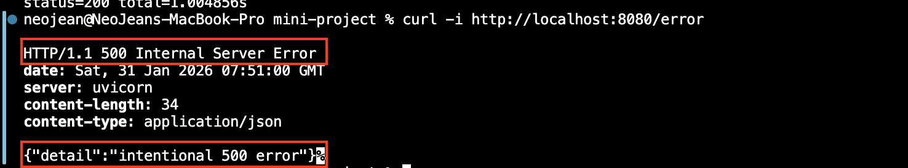

This endpoint deliberately increases the `HTTP 5xx` error rate. It supplies the test traffic used to validate the availability SLI, error-rate SLI, and associated alert rules.

#### 2.1.4 Implementation

The complete API implementation is available in [`api/main.py`](api/main.py).

### 2.2 Observability Stack

This project implements metrics-based observability through a reproducible `collect → visualize → alert` workflow.

#### 2.2.1 Metrics Collection with Prometheus

Prometheus provides quantitative visibility into service health. The API exposes Prometheus-formatted metrics through `/metrics`, and Prometheus scrapes that endpoint periodically to store the results as time-series data.

The project collects the following SLI candidate metrics:

- Request traffic
- Request latency
- Server-side error rate (`HTTP 5xx`)

These metrics provide the foundation for defining SLIs and SLOs, calculating the error budget, and designing actionable alert rules.

##### 2.2.1.1 API-to-Prometheus Metrics Flow

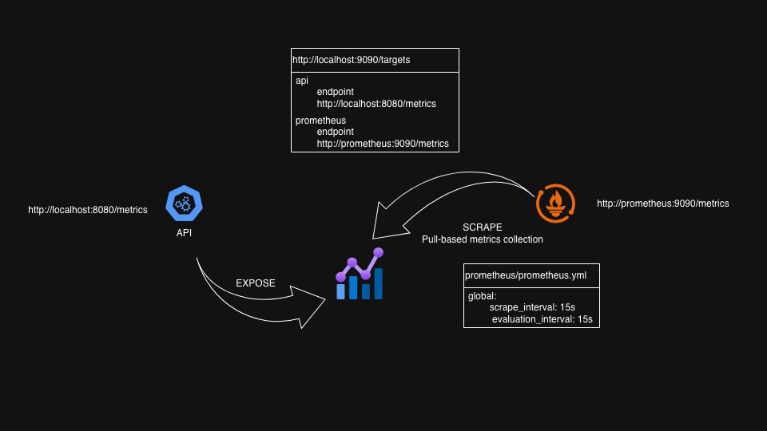

Prometheus scrapes the API's `/metrics` endpoint at the configured `15s` interval. This interval was selected to:

- Reflect metric changes quickly in a demonstration environment
- Avoid unnecessary load from excessively frequent scrapes

The setting is intended for experimentation and validation; it is not presented as a universally optimal production value.

##### 2.2.1.2 Metrics Exposure

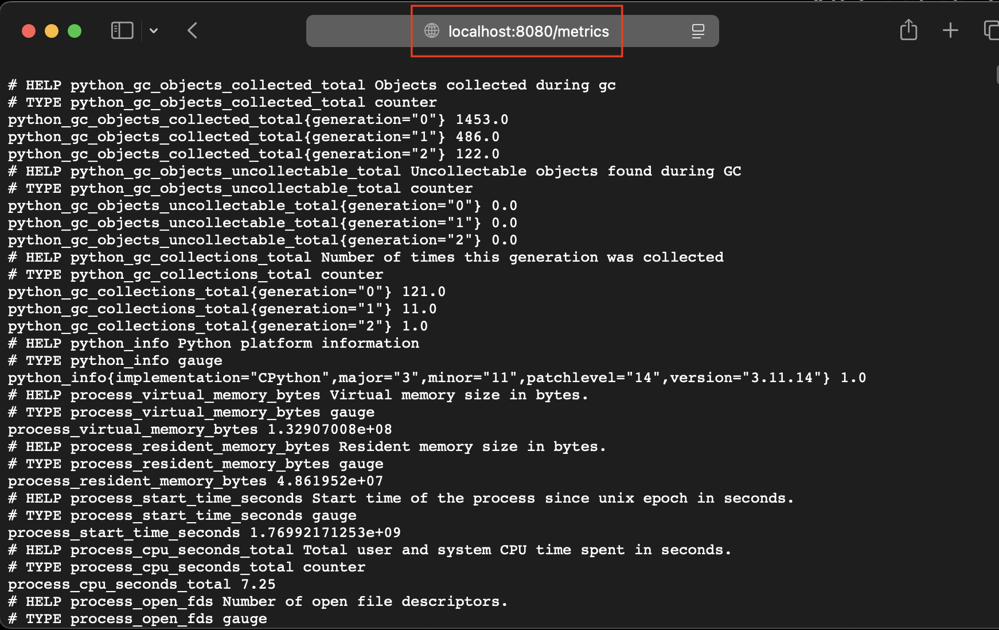

The API exposes Prometheus-formatted metrics through `/metrics`:

- Host-accessible endpoint: `http://localhost:8080/metrics`
- Prometheus scrape target inside the Docker network: `http://api:8080/metrics`

Separating host and container-network addresses allows Prometheus to collect metrics reliably while keeping the endpoint easy to inspect from the local machine.

##### 2.2.1.3 Prometheus Scraping

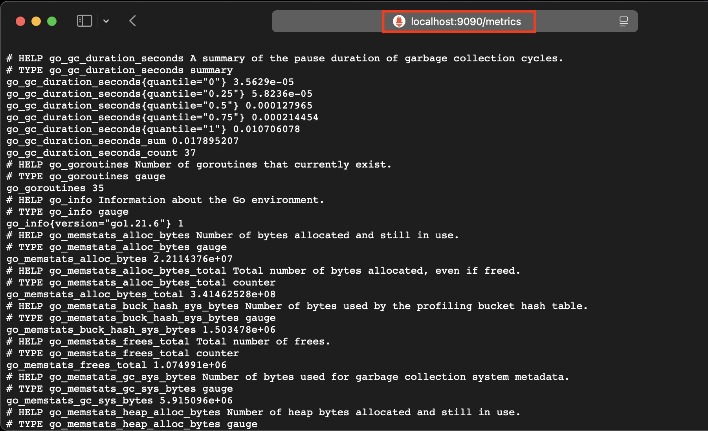

Prometheus periodically scrapes the API service over the Docker network. Its UI is available at `http://localhost:9090`, where the target status and stored time-series data can be inspected.

##### 2.2.1.4 Prometheus Queries

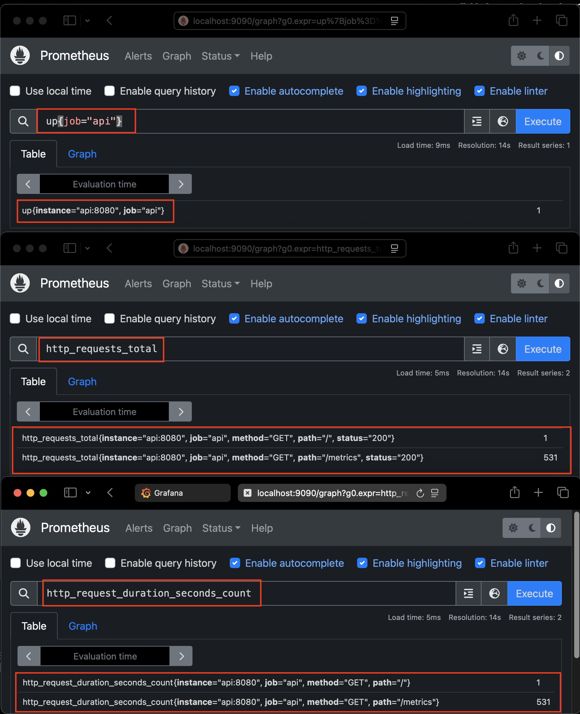

The primary application metrics are:

- `http_requests_total`
  - Type: `Counter`
  - Meaning: cumulative request count
- `http_request_duration_seconds`
  - Type: `Histogram`
  - Meaning: request-latency distribution

The counter is used to calculate traffic, success rate, and error rate. The histogram provides the bucket data required to calculate tail-latency percentiles such as `p95` and `p99`.

Together, these metrics support the availability, latency, and error-rate SLIs as well as the alert rules built on top of them.

#### 2.2.2 Visualization with Grafana

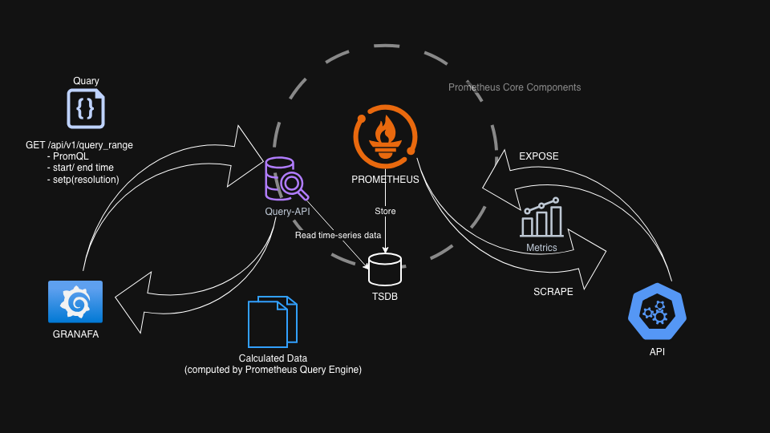

Grafana translates collected metrics into dashboards that operators can interpret quickly. Both the Prometheus data source and the dashboard are provisioned as code rather than created manually through the UI.

The design has three goals:

- Reproduce the same environment with a single `docker compose up -d`
- Eliminate dashboard drift between environments
- Maintain a consistent baseline across failure-injection experiments

The objective is a deterministic observability environment that produces the same views every time it is started—not a dashboard that works only in one manually configured environment.

##### 2.2.2.1 Data Source Provisioning

The Prometheus data source uses a fixed Grafana UID:

- Data source UID: `prometheus`
- Prometheus URL: `http://prometheus:9090` within the Docker network

```yaml
apiVersion: 1
datasources:
  - name: prometheus
    uid: prometheus
    url: http://prometheus:9090
```

Grafana dashboards reference data sources by UID. Without a stable UID, restarting or rebuilding the environment could recreate the data source and break dashboard references. Provisioning the data source declaratively prevents that drift.

> Grafana is managed as declarative configuration rather than environment-specific state.

The complete configuration is available in [`grafana/provisioning/datasources/prometheus.yml`](grafana/provisioning/datasources/prometheus.yml).

##### 2.2.2.2 Dashboard Provisioning

At startup, Grafana automatically loads JSON dashboard definitions from `grafana/dashboards/`, including `sre-dashboard.json`.

```yaml
apiVersion: 1

providers:
  - name: "mini-project"
    type: file
    folder: "mini-project"
    folderUid: "mini-project"
    editable: true
    updateIntervalSeconds: 30
    options:
      path: /var/lib/grafana/dashboards
```

- The dashboard appears under the `mini-project` folder in the Grafana UI.
- The same dashboard is recreated without any manual UI configuration.

The provisioning configuration is available in [`grafana/provisioning/dashboards/dashboards.yml`](grafana/provisioning/dashboards/dashboards.yml).

##### 2.2.2.3 Dashboard Panels

The default dashboard contains three panels that represent the service's core reliability signals.

1. **Traffic (requests per second)**

    ```json
    "title": "Traffic (RPS)",
    "type": "timeseries",
    "datasource": {
      "type": "prometheus",
      "uid": "prometheus"
    },
    "targets": [
      {
        "expr": "sum(rate(http_requests_total[1m]))",
        "refId": "A"
      }
    ],
    "gridPos": { "h": 8, "w": 24, "x": 0, "y": 16 }
    ```

    The traffic panel visualizes API request volume in requests per second (RPS). It supports:

    - Detecting changes in service load
    - Identifying traffic patterns
    - Comparing behavior before, during, and after an incident

    Traffic is one of the four golden signals commonly used in SRE to identify changes in system demand.

2. **Error Rate (`HTTP 5xx`)**

    ```json
    "title": "Error Rate (5xx)",
    "type": "timeseries",
    "datasource": {
      "type": "prometheus",
      "uid": "prometheus"
    },
    "targets": [
      {
        "expr": "sum(rate(http_requests_total{status=~\"5..\"}[5m])) / sum(rate(http_requests_total[5m]))",
        "refId": "A"
      }
    ],
    "gridPos": { "h": 8, "w": 24, "x": 0, "y": 8 }
    ```

    This panel shows the proportion of all requests that return `HTTP 5xx` responses. The signal matters because:

    - Server errors directly affect the user experience
    - The metric is directly related to the availability SLI and error budget
    - It is a primary decision signal for alerting

    Under normal conditions, the value converges toward `0`. A sharp increase provides immediate evidence of abnormal service behavior.

3. **Latency (`p95`)**

    ```json
    "title": "Latency p95 (Histogram)",
    "type": "timeseries",
    "datasource": {
      "type": "prometheus",
      "uid": "prometheus"
    },
    "targets": [
      {
        "expr": "histogram_quantile(0.95, sum(rate(http_request_duration_seconds_bucket[5m])) by (le))",
        "refId": "A"
      }
    ],
    "gridPos": { "h": 8, "w": 24, "x": 0, "y": 0 }
    ```

    Average latency can hide a smaller population of significantly slower requests. This project therefore uses histogram-based `p95` latency to support:

    - Tail-latency analysis
    - User-perceived performance evaluation
    - Validation of the latency SLO

##### 2.2.2.4 Visualization Result

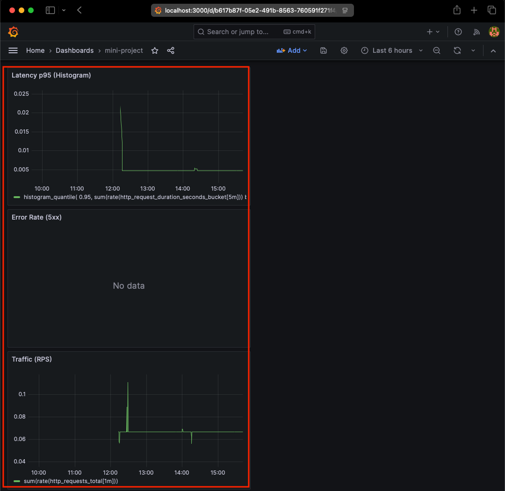

The dashboard combines traffic, server errors, and request latency into a single operational view. It confirms that Prometheus metrics collection and Grafana visualization are integrated correctly and provides a baseline for real-time service-health analysis.

The next layer of the stack uses Prometheus alert rules and Alertmanager to detect and route abnormal conditions automatically.

The complete dashboard definition is available in [`grafana/dashboards/sre-dashboard.json`](grafana/dashboards/sre-dashboard.json).

#### 2.2.3 Alerting with Prometheus and Alertmanager

Prometheus alert rules detect potential reliability violations using the following SLI-aligned signals:

- Availability
- Error rate (`HTTP 5xx`)
- Latency (`p95`)

Prometheus determines **when** a defined reliability condition has been breached. Grafana provides the context needed to investigate **why** the condition occurred. Alertmanager then handles alert grouping, deduplication, routing, and delivery.

The project defines three primary alerts:

- **API Down**: detects a loss of service availability
- **High Error Rate (`5xx`)**: detects an elevated proportion of server errors
- **High Latency (`p95`)**: detects sustained response-latency degradation

##### 2.2.3.1 Alerting Architecture

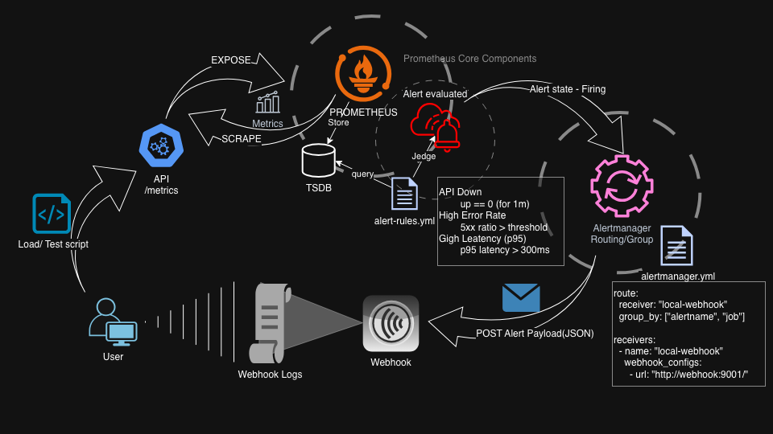

The alerting workflow is:

1. Prometheus collects metrics and evaluates alert rules.
2. Prometheus creates an alert event when a rule condition is satisfied.
3. Alertmanager receives the event.
4. Alertmanager groups, deduplicates, routes, and delivers the alert according to the configured policy.

This separation keeps alert evaluation independent from delivery behavior, improving clarity and making notification channels easier to extend.

##### 2.2.3.2 Alert Validation Summary

The following behaviors were validated:

- Prometheus evaluates the rules defined in `alert-rules.yml` successfully.
- Alert state transitions follow `Inactive → Pending → Firing → Resolved`.
- Alertmanager receives and routes alerts correctly.
- A local webhook receiver confirms end-to-end delivery.
- The complete workflow can be reproduced without external Slack or email dependencies.

**Validation scope**

- **Rule evaluation**

    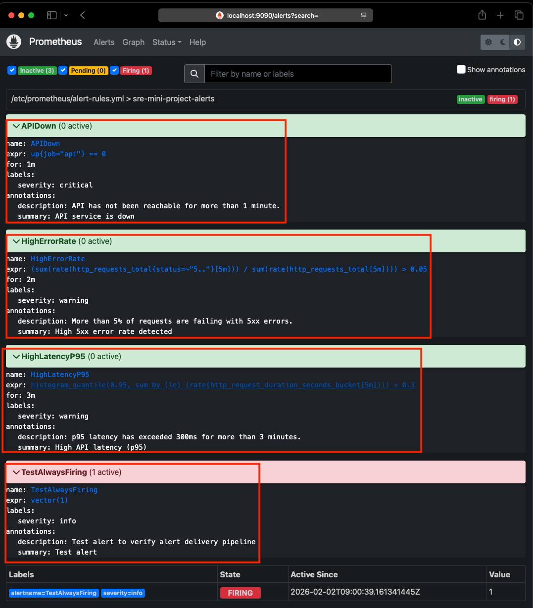
    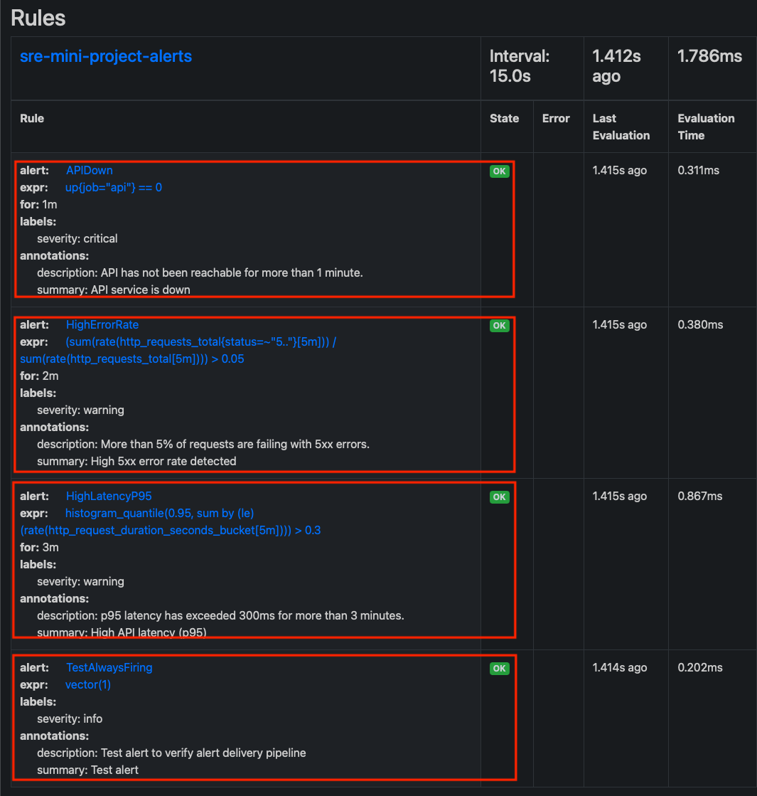

    Prometheus successfully evaluated the rules in `alert-rules.yml`. A test-only `TestAlwaysFiring` rule was used to validate the delivery pipeline; it was disabled after testing, and Prometheus was restarted to reset the alert state.

- **State transitions**

    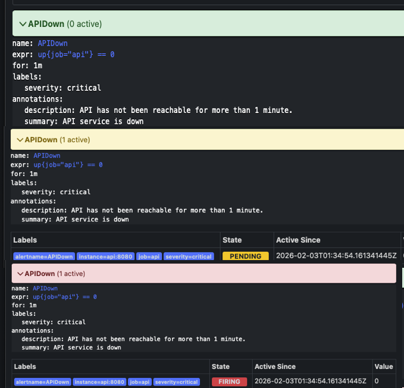

    The alert progressed through `Inactive → Pending → Firing → Resolved`. This confirmed that the rule's `for` clause filters transient spikes and fires only when the abnormal condition persists.

- **Routing and grouping**

    Alertmanager logs confirmed that the `APIDown` alert was received and processed according to the configured `route` and `group_by` policies.

- **Delivery**

    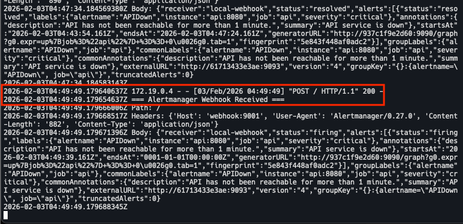

    Alertmanager logged successful delivery to `receiver=local-webhook`. The webhook receiver accepted the JSON payload and returned `HTTP 200`, confirming that the alert reached the final delivery stage.

**Validation result**

- Alert state changed as expected under the configured conditions.
- Alertmanager applied the configured routing and grouping policies.
- The webhook receiver accepted the alert payload and confirmed delivery with `HTTP 200`.

**Reproducibility**

The alert rules, Alertmanager configuration, and local webhook receiver are all defined through Docker Compose and version-controlled configuration. Anyone running the same stack can reproduce the validation without relying on external notification services.

##### 2.2.3.3 Validation Evidence

Prometheus Alerts UI confirmed the `APIDown` transition from `Inactive` to `Pending` and then `Firing`.

1. **Alertmanager logs**

    ```bash
    docker logs -f --timestamps alertmanager | grep -Ei 'dispatch|notify|webhook|receiver|route|group'
    ```

    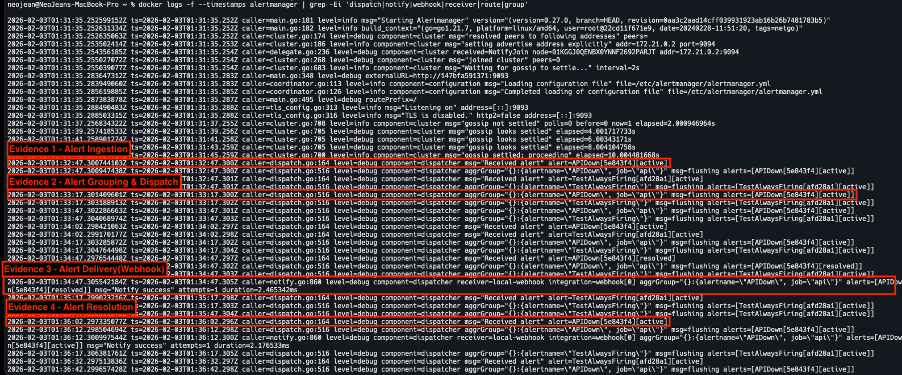

2. **Webhook logs**

    ```bash
    docker logs --tail 10 webhook
    ```

    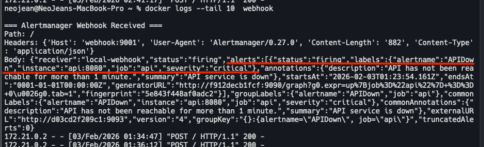

    The logs show Alertmanager delivering the `APIDown` alert to the `local-webhook` receiver with an HTTP `POST` request.

3. **Alert payload excerpt**

    ```json
    {
      "status": "firing",
      "labels": {
        "alertname": "APIDown",
        "instance": "api:8080",
        "job": "api",
        "severity": "critical"
      }
    }
    ```

##### 2.2.3.4 Findings and Improvements

The validation identified the following operational trade-offs:

- The `for` duration balances detection speed against unnecessary alert noise.
- The initial `p95` threshold is a hypothesis and should be recalibrated against representative production traffic.
- A single-signal alert can generate noise or lack sufficient incident context.

Planned improvements include:

- SLO-based alerting
- Multi-window, multi-burn-rate alerts to reduce false positives

### 2.3 SLI and SLO Design

---

This section defines the service level indicators (SLIs) used to measure reliability and the service level objectives (SLOs) that establish quantitative targets.

- An **SLI** defines what is measured.
- An **SLO** defines the acceptable target for that measurement.

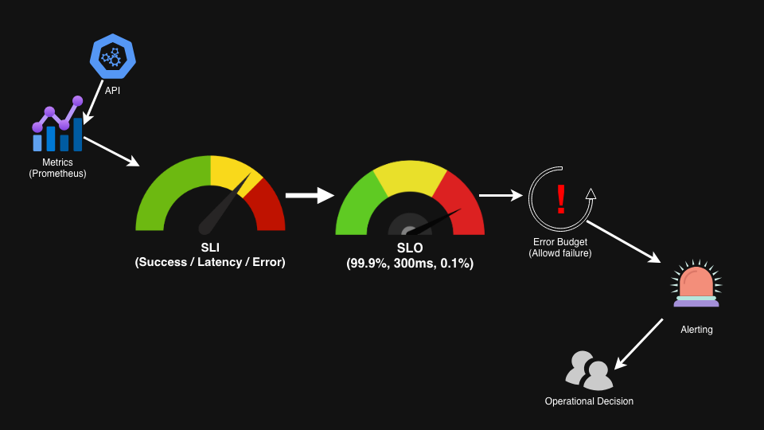

*Figure: Metrics → SLIs/SLOs → Error budget → Operational decisions*

#### 2.3.1 Service Scope and Definition

- **Service name**: `fastapi-app`
- **Service type**: HTTP API service
- **Users**: internal and demonstration users
- **Critical user journeys**:
  - UJ-1: `GET /health` returns `200 OK`.
  - UJ-2: Primary API endpoints respond successfully within the accepted latency threshold.

**Out of scope**

- Client-side network failures
- DNS resolution failures
- Non-production environments outside this demonstration stack

The SLIs and SLOs evaluate server-side service quality. External network conditions and failures caused by invalid user input are excluded.

#### 2.3.2 SLI Selection Rationale

Each SLI must meet three criteria:

- **User-centric**: reflects an outcome that users experience directly
- **Measurable**: can be quantified using Prometheus data
- **Actionable**: supports operational decisions, incident response, or reliability improvements

The project therefore uses three SLIs:

- **Availability (success rate)**
- **Latency (`p95`)**
- **Error rate (`HTTP 5xx`)**

#### 2.3.3 SLI Definitions

##### SLI-1: Success Rate (Availability)

**Definition**

The proportion of eligible requests processed successfully.

- **Good events**: HTTP status codes `2xx` and `3xx`
- **Bad events**: HTTP status codes `5xx`
- **Excluded events**: `4xx` responses, which are treated as client-side failures under this policy

**Formula**

```text
Success Rate = Good Requests / (Good Requests + Bad Requests)
```

**PromQL**

```promql
sum(rate(http_requests_total{job="api", status=~"2..|3.."}[5m]))
/
sum(rate(http_requests_total{job="api", status=~"2..|3..|5.."}[5m]))
```

This indicator directly represents service availability and provides the basis for the availability SLO and error-budget calculation.

##### SLI-2: Request Latency (`p95`)

**Definition**

The 95th percentile of HTTP request duration, calculated from the request-latency histogram.

- Represents tail latency, including a meaningful portion of slower requests
- Better reflects user-perceived performance than an average alone

**PromQL**

```promql
histogram_quantile(
  0.95,
  sum by (le) (
    rate(http_request_duration_seconds_bucket{job="api"}[5m])
  )
)
```

##### SLI-3: Error Rate (`HTTP 5xx`)

**Definition**

The proportion of all requests that result in a server-side `HTTP 5xx` response.

- Directly represents server-side processing failures
- Complements the availability SLI during incident analysis

**Formula**

```text
Error Rate = HTTP 5xx Requests / Total Requests
```

**PromQL**

```promql
sum(rate(http_requests_total{job="api", status=~"5.."}[5m]))
/
sum(rate(http_requests_total{job="api"}[5m]))
```

#### 2.3.4 SLO Definitions

##### SLO-1: Availability

- **SLI**: success rate
- **Target**: ≥ 99.9%
- **Evaluation window**: rolling 30 days
- **Scope**: all service endpoints

##### SLO-2: Latency

- **SLI**: request latency (`p95`)
- **Target**: ≤ 300 ms
- **Evaluation window**: rolling 30 days
- **Scope**: primary user-facing endpoints

##### SLO-3: Error Rate

- **SLI**: error rate (`HTTP 5xx`)
- **Target**: ≤ 0.1%
- **Evaluation window**: rolling 30 days
- **Scope**: all service endpoints

#### 2.3.5 SLO Summary

| SLO ID | SLI | Good Event | Bad Event | Target | Window |
| --- | --- | --- | --- | --- | --- |
| SLO-1 | Success rate | `HTTP 2xx` or `3xx` | `HTTP 5xx` | ≥ 99.9% | 30 days |
| SLO-2 | Latency (`p95`) | Request ≤ 300 ms | Request > 300 ms | ≤ 300 ms | 30 days |
| SLO-3 | Error rate | Non-`5xx` response | `HTTP 5xx` | ≤ 0.1% | 30 days |

#### 2.3.6 Error Budget

An error budget is the amount of unreliability permitted by an SLO. It is not a rule enforced by the system; it is a decision-making framework for balancing reliability work and feature delivery.

For the rolling 30-day SLO window:

```text
Error Budget = 1 - SLO Target
```

For the availability SLO:

- **Availability target**: ≥ 99.9%
- **Permitted error budget**: up to 0.1% of eligible requests may fail during the rolling 30-day window

In other words, up to 0.1% of eligible requests may return `HTTP 5xx` during the evaluation window before the availability SLO is breached.

##### Operational Interpretation

- If the error budget is being consumed rapidly, reliability improvements and incident analysis take priority over new feature delivery.
- If budget consumption remains within the expected rate, feature development and deployments can continue under the established operating policy.

This project defines the error budget at the design level, establishing a foundation for SLO-based alerts and future release-governance policies.

The detailed design is also available in [`docs/sli_slo_design.pdf`](docs/sli_slo_design.pdf).

### 2.4 Failure Scenario and Incident Response

---

This section deliberately reproduces a plausible service failure and documents the complete incident-response lifecycle from detection through recovery and learning. The purpose is not merely to create a failure, but to demonstrate how it is identified, assessed, contained, and resolved using SRE practices.

#### 2.4.1 Incident Scenario Overview

##### 2.4.1.1 Objective

The experiment validates that an SLI/SLO-aligned alert behaves correctly during a single, realistic server-side failure scenario.

The objectives are to:

- Select a controlled failure that could plausibly occur in production
- Reproduce a condition directly associated with the defined availability and error-rate indicators
- Validate the complete `Failure → Alert → Response → Recovery` workflow

##### 2.4.1.2 Selected Scenario

- **Scenario**: sustained `HTTP 5xx` responses from the API server
- **Failure type**: server-side failure
- **Purpose**:
  - Observe the impact on the availability SLI
  - Reproduce an error-rate SLI breach

This scenario has a direct and visible user impact: requests fail. It also maps clearly to the availability SLO and error-rate SLI, making it appropriate for alert-design validation.

> The experiment intentionally uses one failure scenario to keep the system behavior and causal chain unambiguous.

#### 2.4.2 Failure Injection

##### 2.4.2.1 Injection Method

The failure is injected by repeatedly calling the API's `/error` endpoint, which returns `HTTP 500` by design.

```bash
curl -i http://localhost:8080/error
```

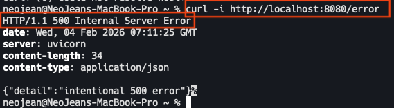

The following load-generation command sustains error traffic for two minutes so that the error-rate SLI can satisfy the alert condition:

```bash
docker compose run --rm loadgen sh -lc '
end=$(( $(date +%s) + 120 ))
i=0
while [ $(date +%s) -lt $end ]; do
  i=$((i+1))
  code=$(curl -s -o /dev/null -w "%{http_code}" http://api:8080/error)
  printf "%s #%03d code=%s\n" "$(date "+%H:%M:%S")" "$i" "$code"
  sleep 0.2
done
'
```

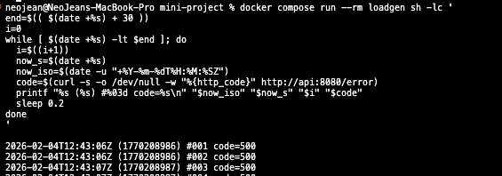

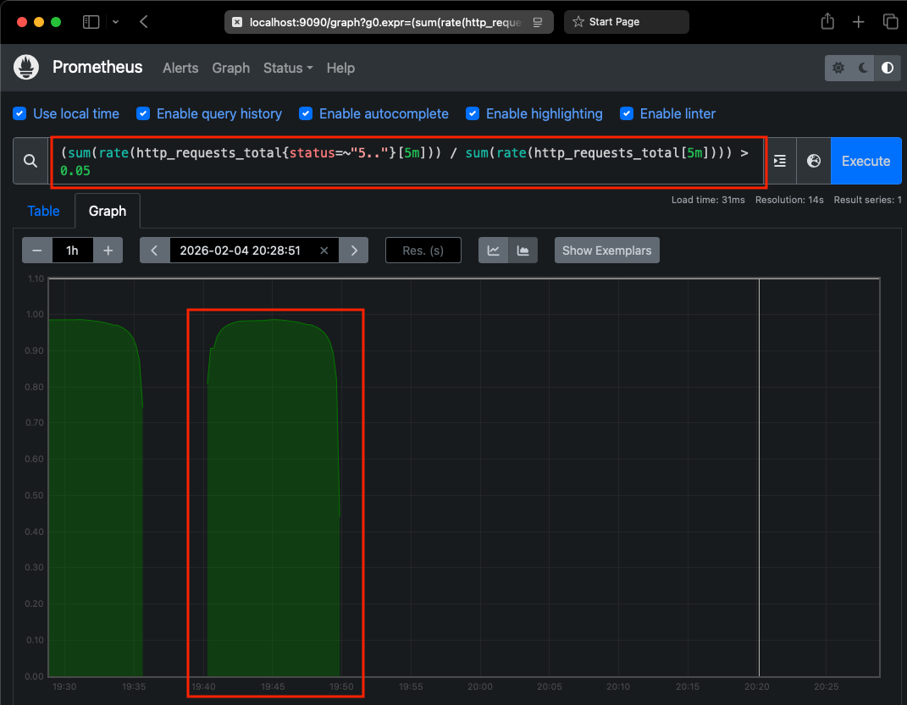

This method provides the following properties:

- The cause is explicit and controlled.
- Normal operation can be restored immediately after the experiment.
- Anyone using the same Docker Compose environment can reproduce the test without additional tooling.
- The injection does not create permanent system changes.

##### 2.4.2.2 Expected Effects

The injected traffic is expected to:

- Increase the `HTTP 5xx` error-rate SLI
- Reduce the success rate and place the availability SLO at risk
- Trigger the Prometheus error-rate alert rule

This verifies whether the alert protects the SLO as intended rather than firing solely because an isolated request crossed a threshold.

> This is a deliberate, controlled failure intended exclusively for experimentation in this environment.

#### 2.4.3 Detection

##### 2.4.3.1 Detection Mechanism

The incident is detected by the `HighErrorRate` rule defined in [`prometheus/alert-rules.yml`](prometheus/alert-rules.yml). Prometheus continuously evaluates the proportion of API requests returning `HTTP 5xx`.

```yaml
- alert: HighErrorRate
  expr: |
    (
      sum(rate(http_requests_total{status=~"5.."}[5m]))
      /
      sum(rate(http_requests_total[5m]))
    ) > 0.05
  for: 2m
  labels:
    severity: warning
  annotations:
    summary: "High 5xx error rate detected"
    description: "More than 5% of requests are failing with 5xx errors."
```

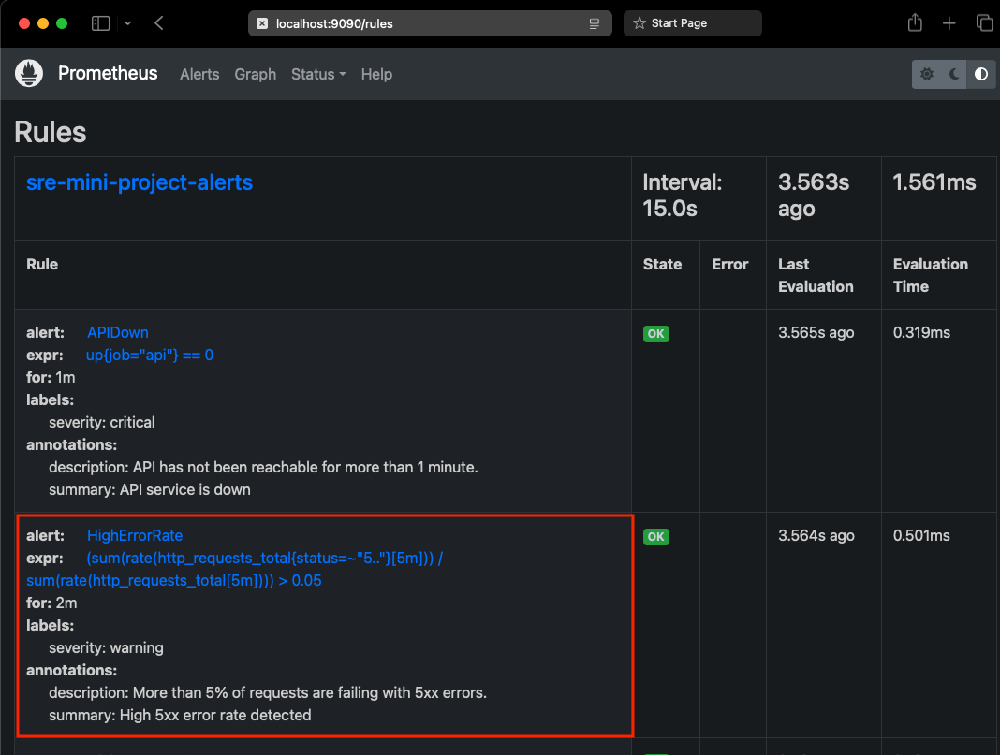

The rule detects an incident when the five-minute error-rate calculation remains above `5%` for two minutes.

##### 2.4.3.2 Detection Process

1. The API begins returning sustained `HTTP 5xx` responses.

    ```bash
    docker logs -f --timestamps api
    ```

    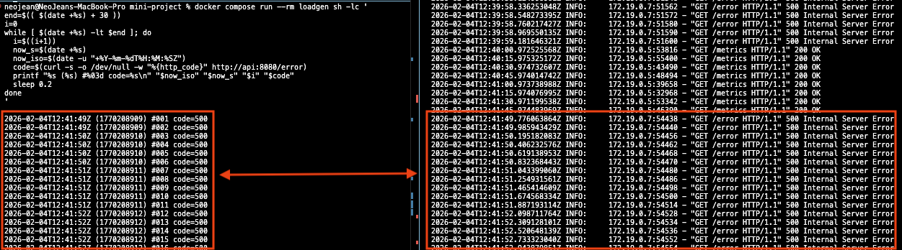

    The logs confirm that repeated requests failed with `HTTP 500`, indicating a sustained server-side error condition.

2. The error-rate SLI exceeds the defined threshold.

    The following command polls the Prometheus Alerts API and captures changes to the `HighErrorRate` state:

    ```bash
    docker compose exec -T prometheus sh -lc '
    for i in $(seq 1 120); do
      ts=$(date -Iseconds)
      echo "===== $ts ====="
      wget -qO- "http://localhost:9090/api/v1/alerts" \
        | tr "," "\n" \
        | sed -n -e "/\"alertname\":\"HighErrorRate\"/p" -e "/\"state\":\"/p" -e "/\"activeAt\"/p"
      echo
      sleep 5
    done
    '
    ```

    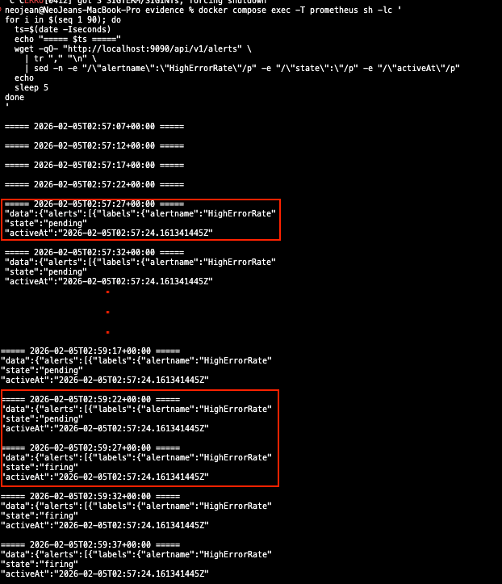

    Prometheus displays evidence timestamps in UTC. It continuously evaluates the error-rate SLI over a five-minute sliding window. Once the calculated error rate remained above `0.05` for two minutes, `HighErrorRate` transitioned from `Pending` to `Firing`.

3. The alert state transitions according to the rule evaluation.

    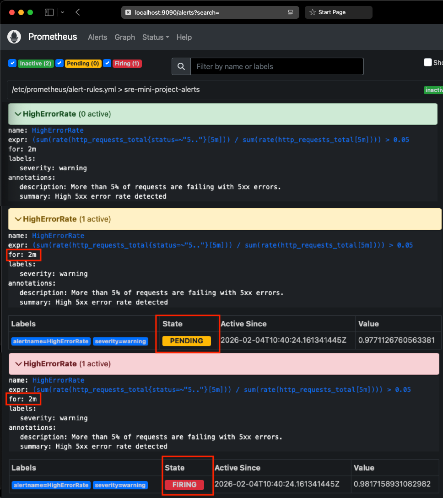

    > `Inactive → Pending → Firing`

    The Prometheus Alerts API output and the `activeAt` timestamp confirm that the breach persisted long enough to satisfy the `for: 2m` condition. This demonstrates that the alert distinguishes a sustained SLI breach from a transient error spike.

##### 2.4.3.3 Detection Time

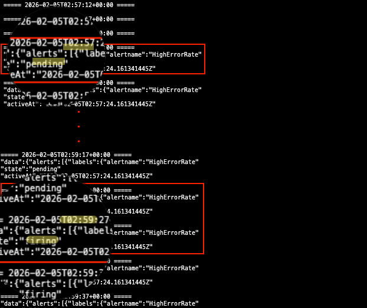

`HighErrorRate` does not fire immediately after the error rate crosses the threshold. It first enters `Pending` and becomes `Firing` only after the breach has persisted for at least two minutes, plus the applicable scrape and rule-evaluation interval.

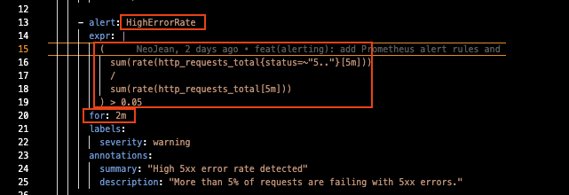

This detection delay is intentional:

- It reduces alert noise from transient failures.
- It treats only sustained errors as a reliability violation.
- It provides a more stable signal for protecting the availability SLO.

> The alert is tied to the error-rate SLI and designed to protect the availability SLO; it is not merely a notification for an isolated threshold crossing.

#### 2.4.4 Impact Analysis

##### 2.4.4.1 User Impact

During the incident, API requests returned `HTTP 500` instead of the expected successful responses. The failure was immediately visible to clients and users.

- **Requests failed with `HTTP 500`**

    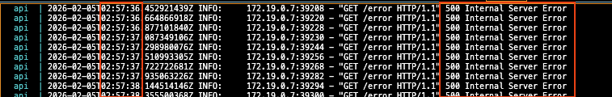

    The API logs show repeated failed requests, confirming that the server could not complete normal request processing.

- **Clients could not complete expected operations**

    A caller received an explicit `HTTP 500` response and could therefore identify the request as failed.

- **The failure was directly observable from the user perspective**

    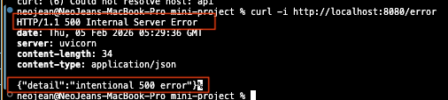

    The status code clearly communicated a server-side failure to the caller.

Log evidence from the incident window confirmed multiple `HTTP 500` responses. Regardless of client retry behavior, this condition represents degraded service reliability for users and dependent systems.

##### 2.4.4.2 SLO Impact

The incident affected both the availability SLO and the error-rate SLI defined in [Section 2.3](#23-sli-and-slo-design).

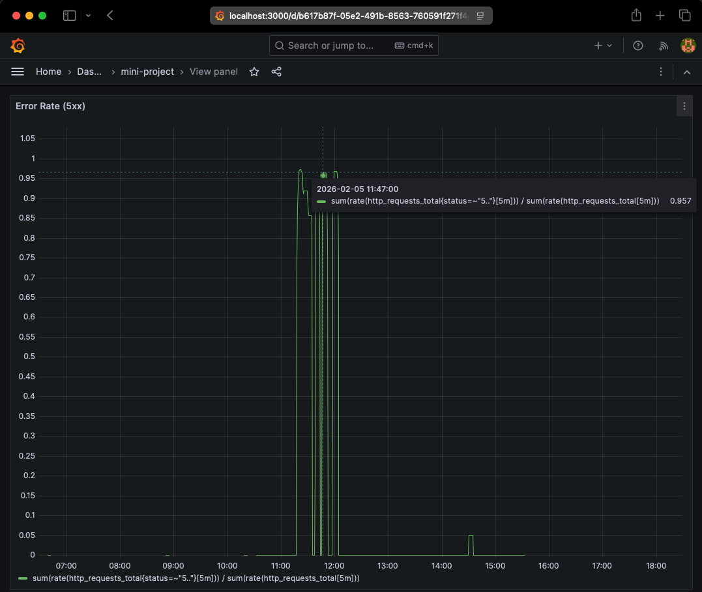

- **Availability**
  - The success rate declined during the incident, placing the service in breach of—or close to breaching—the availability target for the observed window.
- **Error budget consumption**
  - The error rate exceeded `0.6` during the observed period. Using `Availability = 1 - Error Rate`, the corresponding success rate fell below `40%` for that period.

Sustained `HTTP 5xx` responses therefore degraded both the availability and error-rate indicators. The resulting error-budget impact must be assessed cumulatively across the rolling SLO window rather than from the isolated event alone.

The event is classified as a **reliability-impacting incident** because it directly affected successful user requests.

#### 2.4.5 Response

##### 2.4.5.1 Initial Assessment

Before taking corrective action, the response prioritized confirming service status and determining the scope of the incident:

- Reviewed the `HTTP 5xx` error rate and overall request volume in Grafana
- Determined whether the issue affected one endpoint or the broader service
- Established whether the errors represented a transient spike or a sustained condition

This evidence-first assessment reduced the risk of unnecessary restarts, ineffective remediation, or incorrect assumptions about the failure.

##### 2.4.5.2 Remediation

After confirming that the issue was caused by controlled failure injection, the following actions were taken:

- Verified the failure-injection process.
- Stopped requests to the `/error` endpoint.
- Restarted the API service only if required to restore normal operation.

The remediation was deliberately limited to the minimum change required to recover the service.

##### 2.4.5.3 Response Model

- **Response type**: manual
- **Operating method**: standard runbook-based checks

Manual intervention was appropriate because the exercise was designed to validate the incident-response workflow rather than automated remediation.

The investigation followed a blameless approach focused on causal analysis, learning, and prevention. It did not assign fault to an individual or isolated component.

#### 2.4.6 Recovery

##### 2.4.6.1 Recovery Point

After failure injection stopped, the API resumed successful responses and the alert resolved:

- Normal responses were confirmed.
- Alert state transitioned from `Firing` to `Resolved`.

This transition indicated that the error-rate SLI had returned to its normal range.

##### 2.4.6.2 Recovery Criteria

Recovery was determined through the predefined reliability indicators rather than a single successful request:

- **Error-rate SLI**: returned to the normal range
- **Availability indicator**: stabilized

Grafana and Prometheus data confirmed both conditions.

> The service recovered to a state consistent with the defined SLO criteria.

#### 2.4.7 Lessons Learned

##### 2.4.7.1 What Worked Well

- The error-rate alert detected early evidence of an availability SLO risk.
- The complete `Failure → Detection → Response → Recovery` process was validated clearly.
- SLI and SLO criteria provided a consistent basis for assessing both impact and recovery.

The experiment confirmed that alerting can serve as an operational control for protecting reliability, rather than acting as a standalone notification mechanism.

##### 2.4.7.2 Areas for Improvement

- A single error-rate signal may produce noise in some traffic patterns.
- SLI threshold alerts alone provide limited insight into long-term reliability and error-budget health.

Planned improvements include:

- SLO-based alerting
- Multi-window, multi-burn-rate alerts to reduce false positives

##### 2.4.7.3 Next Steps

- Add a `p95` latency failure scenario to evaluate the impact of slow responses on user experience.
- Expand repeatable incident-response tasks into a documented runbook.

These improvements will extend the project from a single incident exercise toward a sustainable reliability operating model.

### 2.5 Root Cause Analysis

---

#### 2.5.1 Incident Summary

This experiment deliberately reproduced sustained `HTTP 5xx` errors in the API. Repeated calls to the FastAPI `/error` endpoint maintained server-error traffic and sharply increased the error-rate SLI.

As a result, the success rate declined and the observed interval reached a condition consistent with SLO risk and error-budget consumption. The purpose was to validate that the SLI/SLO-aligned `Alert → Response → Recovery` workflow behaved as it would in a production-style operating environment.

#### 2.5.2 Scope of Impact

- **User impact**
  - Some API requests failed with `HTTP 500`.
  - Clients expecting a successful response could not complete their requests.
  - The server-side failure was immediately visible to users and calling systems.

- **SLO impact**
  - **Availability SLO**: the reduced success rate placed the service in breach of, or close to, the target during the observed interval.
  - **Error-rate SLI**: the proportion of `HTTP 5xx` responses remained above the `5%` threshold.
  - **Error budget**: the incident consumed part of the rolling 30-day availability error budget.

- **Unaffected areas**
  - No data loss
  - No infrastructure resource exhaustion
  - No unexpected process termination

The incident demonstrates how a single controlled event degrades cumulative reliability indicators within the SLO evaluation window.

#### 2.5.3 Timeline

| Stage | Event |
| --- | --- |
| Failure begins | Repeated `/error` calls sustain `HTTP 500` responses. |
| Metric degradation | The `HTTP 5xx` error rate rises and the success rate declines. |
| Detection | Prometheus evaluates the error-rate SLI over a five-minute sliding window. |
| Pending | The alert enters `Pending` while the threshold breach persists. |
| Firing | `HighErrorRate` enters `Firing` after satisfying `for: 2m`. |
| Response | Grafana dashboards and API logs are used to establish the incident scope. |
| Remediation | Failure injection stops by ending `/error` calls or restarting the API if required. |
| Recovery | The error rate normalizes and the alert transitions to `Resolved`. |

The detection delay is an intentional result of the alert rule's `for` clause. It reduces noise from short-lived errors and alerts only on a sustained reliability signal that threatens the availability SLO.

#### 2.5.4 Root Cause

- **Direct cause**
  - The `/error` endpoint is designed to return `HTTP 500`.
  - Repeated calls sustained a high volume of server-error traffic.

- **Root cause**
  - A controlled failure-injection scenario intentionally maintained enough error traffic to satisfy the error-rate alert condition.

The incident was not caused by an unintended code defect or infrastructure outage. It was the expected outcome of a controlled reliability-validation exercise.

#### 2.5.5 Preventive and Follow-up Actions

**Short term**

- Enable failure-injection endpoints such as `/error` only in test environments.
- Disable or restrict access immediately after an experiment, for example through authentication or an IP allowlist.
- Add an explicit “check for active failure injection” step to the incident runbook.

**Medium to long term**

- **Introduce SLO-based alerts**
  - Replace single-threshold alerts with alerts based on error-budget consumption rate.
- **Adopt multi-window, multi-burn-rate alerting**
  - Distinguish short spikes from sustained incidents and reduce alert noise.
- **Add latency-focused failure scenarios**
  - Validate how elevated `p95` latency affects user experience.
- **Formalize the incident-response runbook**
  - Document the `Detect → Assess → Respond → Recover` workflow to ensure repeatability.

The full incident report is available in [`docs/incident_report.pdf`](docs/incident_report.pdf).
