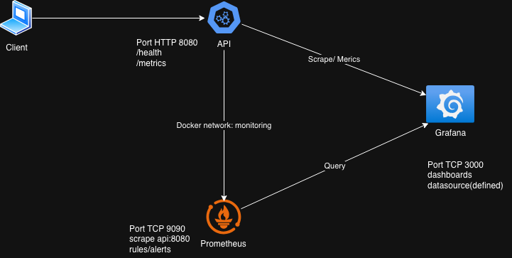
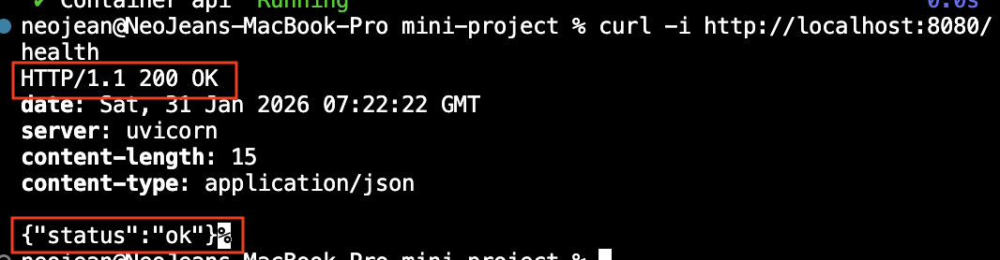
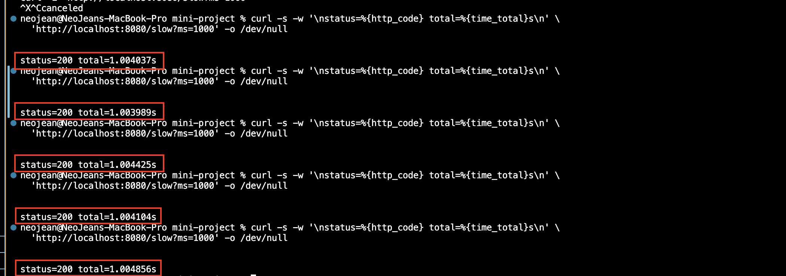

# SRE mini Project

본 프로젝트는 SRE 관점에서

- 서비스 신뢰성 측정
- 관측 가능성(Observability) 구축
- 장애 유도 및 대응
- RCA 문서화

를 목표로 하는 미니프로젝트 입니다.

## 구조



## 2.요구사항

### 2.1. 서비스(API) - Verification

본 API는 신뢰성 테스트 목적의 서비스로, 정상 응답/ 의도적 지연/ 의도적 5xx 오류를 재현할 수 있다.

#### (1) 정상 응답

- Endpoint: `/health`
- Expected: HTTP 200 + JSON body

```bash
curl -i http://localhost:8080/health
```



#### (2) 의도적인 응답 지연

- Endpoint: /slow?ms=1000
- Expected: HTTP 200, total time ≈ 1s 이상

```bash
curl -s -w '\nstatus=%{http_code} total=%{time_total}s\n' 'http://localhost:8080/slow?ms=1000' -o /dev/null
```



#### (3) 의도적인 오류

- Endpoint: /error
- Expected: HTTP 500 (intentional)

```bash
curl -i http://localhost:8080/error
```


### 2.2. Obervability 스택

- Metrics: Prometheus
- Visualization: Grafana
- Alerting: Prometheus Alert Rule 또는 Grafana Alert

### 2.3. SLI/SLO 설계

#### 2.3.1. SLI 정의( 최소 3개 이상)

#### 2.3.2. SLO 정의( 정량적인 목표)

- 30일 기준 Availability
- p95 Latencty 300ms 이하

### 2.4. 장애 시나리오 및 Incident Response

- API서버를 활용해 의도적으로 장애를 발생
- Alert가 정적으로 동작하는 것을 확인
- 장애 발생부터 복구까지의 흐름을 문서로 정리

### 2.5. RCA (Root Cause Analysis)

- 장애 요약
- 영향 범위
- 타임라인 (발생 -> 감지 -> 대응 복구)
- Root Cause
- 재발 방지 대책

## Project Context (for AI assistants)

- This is an SRE mini project using docker-compose
- Prometheus and Grafana are already running with provisioning
- API is FastAPI exposing /health and /metrics
- Current issue: API container not listening on port 8080
