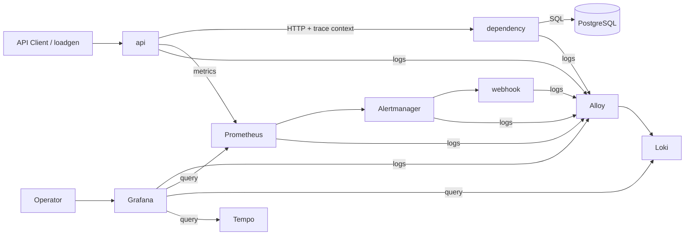

# SRE mini Project (post-submission)

본 프로젝트는 SRE(Site Reliability Engineering) 관점에서 서비스 신뢰성을 관측하고 분석하기 위한 실습형 프로젝트이다.

초기 버전은 `Prometheus`, `Grafana`, `Alertmanager` 중심의 `Metrics + Alerting` 구조였다. 현재 버전은 `Loki`, `Tempo`, `OpenTelemetry`를 포함하여 `Metrics + Logs + Traces` 기반의 Observability 구조로 확장되었다.

이 프로젝트의 핵심 목표는 다음과 같다.

- `Metrics`로 이상 징후를 감지한다.
- `Logs`로 이벤트 수준의 세부 정보를 확인한다.
- `Traces`로 요청 단위의 인과 경로(causal path)를 분석한다.
- 이 세 신호를 결합하여 `RCA (Root Cause Analysis)`가 가능한 구조를 만든다.

## 1. Why This Upgrade?

초기 단일 서비스 버전(initial single-service version)에서는 `/slow`와 `/error`가 모두 `api` 내부에서 직접 발생하였다.

이 구조에서는 다음이 가능했다.

- `Prometheus`로 latency, error rate, availability 확인
- `Grafana`로 시각화
- `Alertmanager`와 `webhook`으로 alert delivery 검증
- 구조화 로그를 통한 이벤트 확인

그러나 다음 질문에는 한계가 있었다.

- 지연(latency)이 ingress에서 발생했는가, downstream에서 발생했는가?
- 오류(error)가 caller에서 시작되었는가, callee에서 시작되었는가?
- 전체 요청 시간(end-to-end latency) 중 어느 구간이 병목(bottleneck)이었는가?

즉, 기존 구조는 symptom은 볼 수 있었지만 요청 단위의 원인 경로를 설명하기에는 부족했다.

본 고도화의 목적은 다음과 같다.

- 요청이 실제로 여러 경계를 통과하도록 구조를 변경한다.
- `Metrics`, `Logs`, `Traces`를 상호 보완적인 증거 체계로 구성한다.
- `Tracing`을 단순한 tool installation이 아니라 RCA 가능한 관측 요소로 만든다.

## 2. Architecture

현재 구조는 두 개의 축으로 볼 수 있다.

- 사용자 요청 경로(Request Path)
- 운영 관측 경로(Observability Path)

### 2.1 Request Path

```text
API Client / loadgen -> api -> dependency -> db
```

### 2.2 Observability Path

```text
api -> Prometheus -> Alertmanager -> webhook
api/dependency/prometheus/alertmanager/webhook/grafana logs -> Alloy -> Loki
Grafana -> Prometheus
Grafana -> Loki
Grafana -> Tempo
```

### 2.3 Full Diagram



## 3. Components

| Component | 기능 (Function) | 역할 (Role) |
|---|---|---|
| `api` | ingress service | 클라이언트 요청을 받는 진입점(entrypoint) |
| `dependency` | downstream service | latency/error가 실제로 발생하는 application boundary |
| `db` (`PostgreSQL`) | persistence layer | DB query latency와 DB-originated failure를 발생시키는 stateful dependency |
| `Prometheus` | metrics collection and rule evaluation | 요청 수, 지연시간, 오류율 수집 및 alert rule 평가 |
| `Alertmanager` | alert routing and delivery | alert grouping, routing, webhook delivery |
| `webhook` | local alert receiver | alert delivery validation |
| `Loki` | log backend | 구조화 로그 저장 및 검색 |
| `Alloy` | log collector | Docker container logs를 수집하여 Loki로 전달 |
| `Tempo` | trace backend | distributed trace 저장 및 조회 |
| `Grafana` | observability UI | Metrics, Logs, Traces를 통합 조회 |

## 4. Observability Design

본 프로젝트의 Observability는 세 가지 신호(signal)를 중심으로 구성된다.

- `Metrics`
- `Logs`
- `Traces`

### 4.1 Metrics

`Prometheus`는 `api`의 `/metrics` endpoint를 scrape하여 다음 지표를 수집한다.

- 요청 수(Request Count)
- 지연 시간(Request Latency)
- 오류율(Error Rate)

이 지표는 다음 목적에 사용된다.

- 이상 징후 탐지
- SLI/SLO 해석
- alert rule 평가

참고:

- Prometheus metric types: https://prometheus.io/docs/concepts/metric_types/

### 4.2 Logs

`Alloy`는 Docker container logs를 수집하고, `Loki`는 이를 저장 및 검색한다.

현재 로그 구조는 다음과 같다.

- `api`: JSON structured log
- `dependency`: JSON structured log
- `webhook`: JSON structured log
- `alertmanager`: logfmt log
- `prometheus`, `grafana`: container log

특히 `api`와 `dependency`는 다음 필드를 포함한다.

- `event`
- `request_id`
- `trace_id`
- `span_id`
- `status_code`
- `duration_ms`

이를 통해 단순한 시간 기반 추정이 아니라 요청 기준 상관분석이 가능하다.

참고:

- Grafana Loki overview: https://grafana.com/docs/loki/latest/get-started/overview/
- Grafana Alloy introduction: https://grafana.com/docs/alloy/latest/introduction/

### 4.3 Traces

`OpenTelemetry`는 다음 경로에 대한 span을 생성한다.

- inbound FastAPI request span
- outbound HTTP client span
- downstream FastAPI request span
- SQLAlchemy / DB query span

`Tempo`는 이 trace를 저장하고, `Grafana`는 이를 조회한다.

현재 trace path는 다음과 같다.

- `GET /item` -> `api -> dependency -> db`
- `GET /slow` -> `api -> dependency -> db`
- `GET /error` -> `api -> dependency -> db`

참고:

- Grafana Tempo documentation: https://grafana.com/docs/tempo/latest/

### 4.4 Signal Correlation

이 프로젝트에서 세 신호는 다음 질문에 답한다.

- `Metrics`: 언제 이상 징후가 발생했는가?
- `Logs`: 어떤 이벤트와 오류가 발생했는가?
- `Traces`: 어느 경로와 어느 hop에서 문제가 시작되었는가?

즉, `Metrics -> Traces -> Logs` 순서로 RCA를 좁혀갈 수 있도록 설계하였다.

## 5. Tracing Design & Implementation

### 5.1 Why Tracing?

Tracing은 단순히 trace backend를 붙이는 것만으로 의미가 생기지 않는다. 요청이 실제로 여러 계층을 통과하고, 각 계층에서 latency 또는 failure가 발생할 수 있어야 한다.

초기 구조에서는 `/slow`와 `/error`가 `api` 내부에서만 발생했기 때문에 tracing을 만들어도 shallow trace만 생성되었다.

현재 구조에서는 다음 경로가 실제로 존재한다.

- `api -> dependency -> db`

이로 인해 tracing은 다음 질문에 답할 수 있다.

- ingress latency와 downstream latency를 구분할 수 있는가?
- failure가 HTTP boundary를 넘어 전파되는가?
- DB query가 실제 bottleneck 또는 root cause가 될 수 있는가?

Tracing의 핵심 전제는 서비스 간 context propagation이며, 이는 같은 요청을 여러 span으로 연결하여 하나의 trace로 구성하게 만든다.

참고:

- OpenTelemetry context propagation: https://opentelemetry.io/docs/concepts/context-propagation/

### 5.2 Added Elements

Tracing을 제대로 동작시키기 위해 다음 요소를 추가하였다.

- `dependency`
- `db`
- `OpenTelemetry instrumentation`
- `Tempo`
- `trace_id` / `span_id` 기반 structured logs

### 5.3 Application Changes

#### `api`

`api`는 더 이상 직접 delay나 `5xx`를 생성하지 않는다.

현재 `api`의 역할은 다음과 같다.

- ingress request 수신
- `dependency` 호출
- trace context propagation
- request-level structured logging
- metrics export

#### `dependency`

`dependency`는 실제 latency와 failure를 발생시키는 downstream service이다.

현재 `dependency`의 역할은 다음과 같다.

- DB 조회 처리
- DB 기반 latency injection
- DB query failure 기반 error injection
- downstream structured logging

#### `/slow`

`/slow`는 더 이상 local sleep이 아니다.

현재 동작은 다음과 같다.

- `api /slow`
- `api -> dependency /slow`
- `dependency -> db`
- `db`에서 `pg_sleep(...)` 수행
- 응답 반환

즉, latency는 실제 downstream + DB 경로에서 발생한다.

#### `/error`

`/error`도 더 이상 local `500`이 아니다.

현재 동작은 다음과 같다.

- `api /error`
- `api -> dependency /error`
- `dependency -> db`
- 존재하지 않는 테이블에 대한 SQL query 수행
- DB query failure 발생
- `dependency`가 `5xx`로 변환하여 반환
- `api`가 downstream failure를 전파

즉, failure는 실제 cross-service path를 따라 전파된다.

### 5.4 Trace-aware Logging

`api`와 `dependency`는 다음 이벤트를 structured log로 남긴다.

- `request_complete`
- `request_exception`
- `dependency_request_started`
- `dependency_request_completed`
- `latency_injection_requested`
- `error_injection_requested`
- `db_latency_injection_requested`
- `db_failure_injection_requested`
- `dependency_error_raised`

이 로그에는 `trace_id`와 `span_id`가 포함되므로, Tempo trace와 Loki logs를 같은 요청 기준으로 묶을 수 있다.

## 6. Quick Start

### 6.1 Prerequisites

- Docker
- Docker Compose

### 6.2 Run Base Stack

기본 스택은 다음 요소를 포함한다.

- `api`
- `dependency`
- `db`
- `prometheus`
- `grafana`
- `alertmanager`
- `webhook`

실행:

```bash
docker compose up -d --build api dependency db prometheus grafana alertmanager webhook
```

### 6.3 Run Extended Observability Stack

확장 Observability 스택은 다음 요소를 추가한다.

- `loki`
- `alloy`
- `tempo`

실행:

```bash
docker compose -f docker-compose.yml -f observability-stack/docker-compose.loki.yml up -d --build \
  api dependency db prometheus grafana alertmanager webhook loki alloy tempo
```

### 6.4 Optional Load Generation

필요 시 `loadgen`을 별도로 실행할 수 있다.

```bash
docker compose run --rm loadgen http://api:8080/health
```

### 6.5 Verify Running Services

```bash
docker compose -f docker-compose.yml -f observability-stack/docker-compose.loki.yml ps
```

### 6.6 Endpoints

| Service | URL |
|---|---|
| API | `http://localhost:8080` |
| Dependency | `http://localhost:8081` |
| Prometheus | `http://localhost:9090` |
| Grafana | `http://localhost:3000` |
| Alertmanager | `http://localhost:9093` |
| Webhook | `http://localhost:9001` |
| Loki | `http://localhost:3100` |
| Tempo | `http://localhost:3200` |

### 6.7 Grafana Credentials

- `username`: `admin`
- `password`: `admin`

## 7. Validation

Tracing 기능은 기능, propagation, storage, UI integration 관점에서 검증하였다.

### 7.1 Functional Validation

정상 조회:

```bash
curl http://localhost:8080/health
curl "http://localhost:8080/item?item_id=1"
```

Latency injection:

```bash
curl "http://localhost:8080/slow?ms=60"
```

Failure injection:

```bash
curl -i "http://localhost:8080/error?code=503"
```

### 7.2 Trace Propagation Validation

다음 기준으로 propagation을 검증하였다.

- 동일 요청의 `trace_id`가 `api`와 `dependency` 로그에 동일하게 기록되는지 확인
- `request_complete` 로그에도 `trace_id`, `span_id`가 포함되는지 확인

예시 해석:

- `api`의 `/slow` request_complete log
- `dependency`의 `/slow` request_complete log

두 로그의 `trace_id`가 동일하면 같은 요청이 cross-service path를 따라 전파되었음을 의미한다.

### 7.3 Trace Storage Validation

`Tempo API`를 통해 특정 `trace_id`를 조회했을 때 실제 trace payload가 반환되는지 확인하였다.

검증 기준:

- trace가 존재하는가
- trace payload 안에 `api`, `dependency` 서비스가 모두 포함되는가

### 7.4 Grafana Integration Validation

`Grafana` provisioning log를 통해 다음 datasource 등록을 확인하였다.

- `Prometheus`
- `Loki`
- `Tempo`

즉, 운영자는 `Grafana`에서 Metrics, Logs, Traces를 한 UI에서 조회할 수 있다.

참고:

- Grafana Tempo data source: https://grafana.com/docs/grafana/latest/datasources/tempo/

## 8. RCA Value

본 프로젝트에서 Tracing은 dashboard decoration이 아니라 `RCA evidence`로 사용된다.

기본적인 RCA 흐름은 다음과 같다.

1. `Prometheus`가 latency 또는 error symptom을 감지
2. `Grafana`에서 영향 시간대 확인
3. `Tempo`에서 해당 요청 trace 조회
4. trace path를 통해 어느 hop에서 latency 또는 error가 시작되었는지 확인
5. 동일 `trace_id`를 기준으로 `Loki`에서 structured logs 조회
6. root cause와 contributing factor를 기록

이 방식은 다음 구분을 가능하게 한다.

- ingress 문제인가, downstream 문제인가
- application 문제인가, DB 문제인가
- symptom만 본 것인가, causal path까지 확보했는가

즉, 본 고도화 이후 tracing은 실제 RCA 수행 시 사용할 수 있는 수준의 설명력을 가진다.

## 9. Current Limitations

현재 tracing 범위는 다음 경로에 집중되어 있다.

- `api -> dependency -> db`

다음 범위는 아직 trace chain에 포함되지 않는다.

- `Prometheus -> Alertmanager -> webhook`
- async worker / queue
- WebSocket / event-driven path

또한 현재는 trace-oriented Grafana dashboard를 별도로 설계하지 않았기 때문에, trace 탐색은 주로 `Grafana Explore`와 log correlation 중심으로 수행한다.

## 10. Next Steps

다음 확장 방향은 다음과 같다.

- alert delivery path와 application path의 correlation 강화
- trace-oriented dashboard 추가
- 더 복잡한 multi-service path 확장
- async worker / queue / WebSocket 기반 경로 추가
- RCA 문서화 체계와 evidence linking 강화

## 11. Summary

본 프로젝트는 초기의 `Metrics + Alerting` 중심 구조에서 다음 단계로 확장되었다.

- `Metrics + Alerting + Centralized Logging + Minimal Distributed Tracing`

핵심 변화는 단순히 `Tempo`를 추가한 것이 아니다.

- 요청 경로를 `api -> dependency -> db`로 재구성하고
- latency와 failure를 실제 downstream / DB에서 발생시키고
- `trace_id` 기반 log correlation을 가능하게 함으로써
- Tracing을 실제 RCA에 사용할 수 있는 관측 요소로 만들었다.
